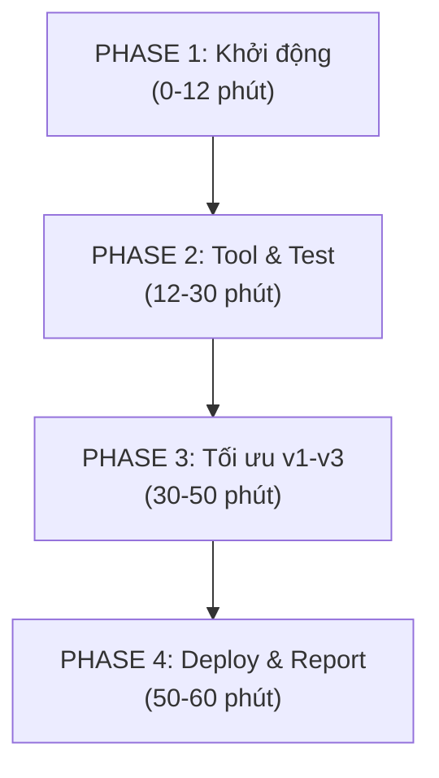

# KẾ HOẠCH CHI TIẾT DỰ ÁN

## 📚 Đề tài: "Trợ lý Tóm tắt Nghiên cứu Khoa học" (Scientific Research Assistant Agent)

---

## 📊 1. BẢNG DANH SÁCH NGUỒN LỰC & VAI TRÒ THÀNH VIÊN

| STT | Họ và Tên                  | Mã Sinh Viên | Vai Trò (Role)                         |    Chức Vụ    | File / Trách Nhiệm Chính                                             |
| :-: | ----------------------------- | :------------: | --------------------------------------- | :--------------: | ----------------------------------------------------------------------- |
|  1  | **Nguyễn Văn Phong**  |  2A202601241  | Role 5 — Product Lead & Demo Presenter | **Leader** | `artifacts/REPORT.md`, `artifacts/version_log.csv`, Kịch bản Demo |
|  2  | **Vũ Huy Hoàng**      |  2A202601057  | Role 1 — Prompt & Agent Architect      |      Member      | `artifacts/system_prompt.md`, `artifacts/tools.yaml`                |
|  3  | **Nguyễn Thanh Phúc** |  2A202601345  | Role 2 — Tool Developer                |      Member      | `tools/paper_summarizer/`, `tools/__init__.py`, `.env`            |
|  4  | **Phạm Khánh Linh**   |  2A202601507  | Role 3 — Eval & QA Specialist          |      Member      | `data/dataset.json`, `data/eval_group.json`, `run_eval.py`        |
|  5  | **Lê Thị Yến Nhi**   |  2A202601031  | Role 4 — UI & Cloud Deployer           |      Member      | `app.py`, `requirements.txt`, Cloudflare Tunnel                     |

---

## 🎯 2. MỤC TIÊU CỦA HỆ THỐNG

Xây dựng một **Research Agent** chuyên về Nghiên cứu Khoa học có khả năng:

1. Tìm kiếm và trích xuất thông tin bài báo khoa học (từ dataset Hugging Face 6,440 bài báo hoặc web/arXiv).
2. Tóm tắt nội dung bài báo khoa học theo cấu trúc chuẩn: *Title, Problem Statement, Methodology, Key Findings, Conclusion*.
3. Xử lý hỏi đáp đa lượt (multi-turn), tự động dùng tool `clarify` khi câu hỏi của user chưa đủ thông tin.
4. Đạt độ chính xác gọi tool (routing accuracy) và truyền tham số (argument accuracy) tối ưu qua các phiên bản `v0` $\rightarrow$ `v3`.

---

## 🚀 3. KẾ HOẠCH THỰC HIỆN CHI TIẾT THEO 4 PHASE

⏱️ **TỔNG THỜI GIAN: 60 phút (1 tiếng lab)**

---

### 🔹 PHASE 1: Khởi Động, Khảo Sát Dữ Liệu & Chạy Baseline (`v0`) - **12 phút (00:00-12:00)**

* **Mục tiêu**: Thiết lập môi trường, khảo sát tập dữ liệu bài báo khoa học và lấy điểm đánh giá mốc `v0`.

#### 📌 Phân công công việc chi tiết (song song):

| **00:00-02:00** | **Nguyễn Văn Phong (Leader)** | Start timer, pull repo, tạo file `PROJECT_PLAN.md` và `TEAMMATE.md` | Báo "Go" cho team |
| **00:00-05:00** | **Nguyễn Thanh Phúc (Role 2)** | Điền API Keys vào `.env`, run `python scripts/preflight_provider.py --provider openai` | Báo kết quả kết nối (✓/✗) cho Leader |
| **00:00-05:00** | **Phạm Khánh Linh (Role 3)** | Load `data/dataset.json` (6,440 bài báo), kiểm tra schema, đếm items. Chuẩn bị run eval | Báo: "Dataset loaded, X items ready" |
| **00:02-08:00** | **Vũ Huy Hoàng (Role 1)** | Đọc `artifacts/system_prompt.md` hiện tại, xác định điểm yếu | Note lại 3-5 điểm cần cải thiện cho v1 |
| **00:05-08:00** | **Lê Thị Yến Nhi (Role 4)** | Verify React client: `cd starter_v0/client && npm install`, test run `npm run dev` (port 5173) | React dev server running ✓ |
| **00:08-12:00** | **Phạm Khánh Linh (Role 3)** | Run eval v0: `python run_eval.py --provider openai --version v0 --suite base --eval-cases data/eval_base.json` | Lưu log JSON vào `runs/v0_baseline.json`, báo accuracy score (expected ~70%) |

**Handoff 12:00**: Phúc & Linh báo xong, có file log v0. Hoàng sẵn sàng edit prompt. Yến Nhi app ready.

* **✅ Sản phẩm hoàn thành Phase 1**: `runs/v0_baseline.json` (accuracy ≥70%), `.env` kết nối OK, Streamlit app stub, notes lỗi

---

### 🔹 PHASE 2: Phát Triển Tool Tóm Tắt Khoa Học & 10 Test Cases Nhóm - **18 phút (12:00-30:00)**

* **Mục tiêu**: Code tool mới `paper_summarizer`, viết 10 test cases, update UI Streamlit.

| **Thời gian**  | **Người**                      | **Nhiệm vụ**                                                                                                                                                                                                    | **Output/Handoff**                                      |
| --------------------- | -------------------------------------- | ----------------------------------------------------------------------------------------------------------------------------------------------------------------------------------------------------------------------- | ------------------------------------------------------------- |
| **12:00-20:00** | **Nguyễn Thanh Phúc (Role 2)** | Tạo`starter_v0/tools/paper_summarizer/tool.py` (query bài báo từ `data/dataset.json`, tóm tắt). Đăng ký vào `__init__.py`. Smoke test: import & call một lần                                          | `paper_summarizer` ready, no errors                         |
| **12:00-20:00** | **Phạm Khánh Linh (Role 3)**   | Viết**10 test cases** vào `data/eval_group.json`: 5 single-turn (tóm tắt bài báo X), 5 multi-turn (hỏi chi tiết phương pháp). Sample từ `data/dataset.json`                                       | `eval_group.json` 10 cases, valid JSON                      |
| **12:00-18:00** | **Vũ Huy Hoàng (Role 1)**      | Viết schema tool mới vào`artifacts/tools.yaml`. Update `system_prompt.md` với rule: *"Nếu user hỏi tóm tắt bài báo → gọi `paper_summarizer`. Nếu chưa có URL/tên → gọi `clarify` trước."* | `tools.yaml` schema OK, `system_prompt.md` v2 draft ready |
| **12:00-25:00** | **Lê Thị Yến Nhi (Role 4)**   | Polish React client: ensure ChatPage.tsx displays tóm tắt + tool trace, sidebar show memories/tools. Test:`npm run dev` works, Flask backend kết nối (port 8000)                                                  | React UI ready,`npm run dev` + `python server.py` ✓      |
| **25:00-30:00** | **Nguyễn Văn Phong (Leader)**  | Review output từ 4 người, viết**Phần A REPORT**: intro, 3-5 demo examples, tool descriptions                                                                                                                 | `artifacts/REPORT.md` Part A done                           |

**Handoff 30:00**: Tất cả report tại leader. Phúc, Hoàng, Linh ready cho Phase 3 (eval).

* **✅ Sản phẩm hoàn thành Phase 2**:
  - `starter_v0/tools/paper_summarizer/` (hoạt động ✓)
  - `starter_v0/data/eval_group.json` (10 test cases ✓)
  - `starter_v0/artifacts/system_prompt.md` v2 draft
  - `starter_v0/artifacts/tools.yaml` schema v2
  - `starter_v0/app.py` Streamlit UI ✓
  - `starter_v0/artifacts/REPORT.md` Part A ✓

---

### 🔹 PHASE 3: Vòng Lặp Tối Ưu Phiên Bản (`v1` ➔ `v2` ➔ `v3`) - **20 phút (30:00-50:00)**

* **Mục tiêu**: 3 vòng lặp prompt/tool optimization, run eval mỗi lần, collect metrics.

#### 📌 **Lượt 1: v1 (6 phút: 30:00-36:00)** — Add clarify rule

| **Thời gian**  | **Người**                     | **Nhiệm vụ**                                                                                                               | **Output**                               |
| --------------------- | ------------------------------------- | ---------------------------------------------------------------------------------------------------------------------------------- | ---------------------------------------------- |
| **30:00-33:00** | **Vũ Huy Hoàng (Role 1)**     | Edit`system_prompt.md`: thêm rule *"Query bài báo → `paper_summarizer`. Thiếu thông tin → `clarify`."* Push v1 file | `system_prompt_v1.md` ready                  |
| **33:00-36:00** | **Phạm Khánh Linh (Role 3)**  | Run eval:`python run_eval.py --provider openai --version v1 --suite base --eval-cases data/eval_base.json`. Lưu log             | `runs/v1_baseline.json`, note accuracy score |
| **36:00**       | **Nguyễn Văn Phong (Leader)** | Add row v1 to`version_log.csv`: version, accuracy, notes                                                                         | `version_log.csv` row 1 ✓                   |

#### 📌 **Lượt 2: v2 (7 phút: 36:00-43:00)** — Tune tool params

| **Thời gian**  | **Người**                     | **Nhiệm vụ**                                                                                            | **Output**                      |
| --------------------- | ------------------------------------- | --------------------------------------------------------------------------------------------------------------- | ------------------------------------- |
| **36:00-39:00** | **Vũ Huy Hoàng (Role 1)**     | Tweak`tools.yaml`: adjust `paper_summarizer` params (query field, result limit, format) based on v1 errors  | `tools_v2.yaml` ready               |
| **39:00-43:00** | **Phạm Khánh Linh (Role 3)**  | Run eval v2:`python run_eval.py --provider openai --version v2 --suite base --eval-cases data/eval_base.json` | `runs/v2_tuned.json`, compare to v1 |
| **43:00**       | **Nguyễn Văn Phong (Leader)** | Add row v2 to`version_log.csv`                                                                                | `version_log.csv` row 2 ✓          |

#### 📌 **Lượt 3: v3 (7 phút: 43:00-50:00)** — Final polish + run both test suites

| **Thời gian**  | **Người**                     | **Nhiệm vụ**                                                                                                                                                                 | **Output**                                             |
| --------------------- | ------------------------------------- | ------------------------------------------------------------------------------------------------------------------------------------------------------------------------------------ | ------------------------------------------------------------ |
| **43:00-45:00** | **Vũ Huy Hoàng (Role 1)**     | Final polish`system_prompt.md` + `tools.yaml` (combine best ideas from v1, v2)                                                                                                   | `system_prompt_v3.md`, `tools_v3.yaml` ready             |
| **45:00-50:00** | **Phạm Khánh Linh (Role 3)**  | Run eval v3 on BOTH suites:`python run_eval.py --provider openai --version v3 --suite base --eval-cases data/eval_base.json` + `--suite group --eval-cases data/eval_group.json` | `runs/v3_base.json` + `runs/v3_group.json`, final scores |
| **50:00**       | **Nguyễn Văn Phong (Leader)** | Add row v3 to`version_log.csv`, prepare comparison table                                                                                                                           | `version_log.csv` rows 1-3 done ✓                         |

* **✅ Sản phẩm hoàn thành Phase 3**:
  - `artifacts/version_log.csv` (v0, v1, v2, v3 accuracy trend)
  - `runs/v1_baseline.json`, `runs/v2_tuned.json`, `runs/v3_base.json`, `runs/v3_group.json`
  - Final `system_prompt_v3.md` & `tools_v3.yaml` (best version)

---

### 🔹 PHASE 4: Deploy Public UI, Hoàn Thiện Report & Final Checks - **10 phút (50:00-60:00)**

* **Mục tiêu**: Public app, complete Part B report, final verification.

| **Thời gian**  | **Người**                                                        | **Nhiệm vụ**                                                                                                                                                                           | **Output/Handoff**                                |
| --------------------- | ------------------------------------------------------------------------ | ---------------------------------------------------------------------------------------------------------------------------------------------------------------------------------------------- | ------------------------------------------------------- |
| **50:00-52:00** | **Lê Thị Yến Nhi (Role 4)**                                     | Terminal 1:`cd starter_v0 && python server.py` (Flask port 8000). Terminal 2: `cd starter_v0/client && npm run dev` (Vite port 5173). Both running for demo                                | Both servers running ✓. Frontend http://localhost:5173 |
| **50:00-55:00** | **Phạm Khánh Linh (Role 3)** & **Vũ Huy Hoàng (Role 1)** | Extract metrics from`runs/v0,v1,v2,v3` logs. Build Part B: (a) accuracy table v0→v3, (b) error analysis, (c) 10 test cases + results                                                        | Part B draft (Markdown table + analysis) → Leader      |
| **52:00-58:00** | **Nguyễn Văn Phong (Leader)**                                    | (1) Add Tunnel URL to Part A. (2) Merge Part B data. (3) Add "Demo Guide" (3-5 example queries & expected output). (4) Final proofread                                                         | `artifacts/REPORT.md` FINAL ✓                        |
| **55:00-60:00** | **Cả 5 Thành Viên**                                             | Final checklist: (1) All files in`starter_v0/` ? (2) `requirements.txt` complete? (3) `.env.example` ready? (4) `version_log.csv` filled? (5) No secrets in repo? (6) README.md exist? | ✅ All checks passed, ready to submit                   |

**Handoff 60:00**: Demo time!

* **✅ Sản phẩm hoàn thành Phase 4**:
  - `app.py` deployed on public URL (Cloudflare Tunnel)
  - `artifacts/REPORT.md` FINAL (Part A + Part B + Demo guide)
  - `artifacts/version_log.csv` complete (v0-v3)
  - `starter_v0/` folder clean & ready to submit
  - Optional: `README.md` with setup instructions
