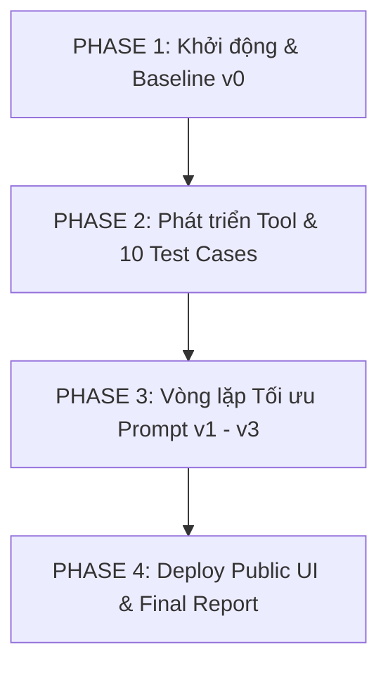

# KẾ HOẠCH CHI TIẾT DỰ ÁN

## 📚 Đề tài: "Trợ lý Tóm tắt Nghiên cứu Khoa học" (Scientific Research Assistant Agent)

---

## 📊 1. BẢNG DANH SÁCH NGUỒN LỰC & VAI TRÒ THÀNH VIÊN

| STT | Họ và Tên                  | Mã Sinh Viên | Vai Trò (Role)                         |    Chức Vụ    | File / Trách Nhiệm Chính                                             |
| :-: | ----------------------------- | :------------: | --------------------------------------- | :--------------: | ----------------------------------------------------------------------- |
|  1  | **Nguyễn Văn Phong**  |  2A202601241  | Role 5 — Product Lead & Demo Presenter | **Leader** | `artifacts/REPORT.md`, `artifacts/version_log.csv`, Kịch bản Demo |
|  2  | **Vũ Huy Hoàng**      |  2A202601057  | Role 1 — Prompt & Agent Architect      |      Member      | `artifacts/system_prompt.md`, `artifacts/tools.yaml`,              |
|  3  | **Nguyễn Thanh Phúc** |  2A202601345  | Role 2 — Tool Developer                |      Member      | `tools/paper_summarizer/`, `tools/__init__.py`, `.env`            |
|  4  | **Phạm Khánh Linh**   |  2A202601507  | Role 3 — Eval & QA Specialist          |      Member      | `data/dataset.json`, `data/eval_group.json`, `run_eval.py`        |
|  5  | **Lê Thị Yến Nhi**   |  2A202601031  | Role 4 — UI & Cloud Deployer           |      Member      | `app.py`, `requirements.txt`, Cloudflare Tunnel                     |

---

## 🎯 2. MỤC TIÊU CỦA HỆ THỐNG

Xây dựng một **Research Agent** chuyên về Nghiên cứu Khoa học có khả năng:

1. Tìm kiếm và trích xuất thông tin bài báo khoa học (từ dataset Hugging Face 6,440 bài báo hoặc web/arXiv).
2. Tóm tắt nội dung bài báo khoa học theo cấu trúc chuẩn: *Title, Problem Statement, Methodology, Key Findings, Conclusion*.
3. Xử lý hỏi đáp đa lượt (multi-turn), tự động dùng tool `clarify` khi câu hỏi của user chưa đủ thông tin.
4. Đạt độ chính xác gọi tool (routing accuracy) và truyền tham số (argument accuracy) tối ưu qua các phiên bản `v0` $\rightarrow$ `v3`.

---

## 🚀 3. KẾ HOẠCH THỰC HIỆN CHI TIẾT THEO 4 PHASE



---

### 🔹 PHASE 1: Khởi Động, Khảo Sát Dữ Liệu & Chạy Baseline (`v0`)

* **Mục tiêu**: Thiết lập môi trường, khảo sát tập dữ liệu bài báo khoa học và lấy điểm đánh giá mốc `v0`.

#### 📌 Phân công công việc chi tiết:

1. **Nguyễn Văn Phong (Leader)**:
   - Tạo file `PROJECT_PLAN.md` định hướng đề tài tóm tắt nghiên cứu khoa học.
   - Kiểm tra kết nối `.env` và giao nhiệm vụ cho từng thành viên.
2. **Nguyễn Thanh Phúc (Role 2)**:
   - Đảm bảo API Keys đã điền đúng trong `starter_v0/.env`.
   - Chạy lệnh kiểm tra kết nối API:
     ```bash
     python scripts/preflight_provider.py --provider openai
     ```
3. **Phạm Khánh Linh (Role 3)**:
   - Kiểm tra dữ liệu 6,440 bài báo khoa học đã convert tại [data/dataset.json](<file:///c:/Users/THIS%20PC/Desktop/IT/AI%20THUC%20CHIEN/Lesson/Lesson5/lab/Day04_2A202601241_NguyenVanPhong/data/dataset.json>).
   - Chạy lệnh eval lấy mốc `v0`:
     ```bash
     python run_eval.py --provider openai --version v0 --suite base --eval-cases data/eval_base.json
     ```
4. **Vũ Huy Hoàng (Role 1)**:
   - Đọc file log `runs/v0_...json` để lọc ra 6 case bị FAIL (tìm hiểu lý do Agent chưa tóm tắt hoặc gọi sai tool).
5. **Lê Thị Yến Nhi (Role 4)**:
   - Tạo file `starter_v0/app.py` và chuẩn bị thư viện Streamlit (`streamlit>=1.30.0`).

* **Sản phẩm hoàn thành Phase 1**: File log JSON mốc `v0` đạt tỉ lệ chính xác 70%.

---

### 🔹 PHASE 2: Phát Triển Tool Tóm Tắt Khoa Học & 10 Test Cases Nhóm

* **Mục tiêu**: Xây dựng **Tool mới tóm tắt bài báo khoa học** và tự thiết kế 10 kịch bản test case thực tế từ dataset Hugging Face.

#### 📌 Phân công công việc chi tiết:

1. **Nguyễn Thanh Phúc (Role 2)**:
   - Phát triển **Tool mới bắt buộc**: `paper_summarizer` (hoặc `dataset_lookup` tra cứu bài báo khoa học từ `data/dataset.json`).
   - Tạo thư mục `starter_v0/tools/paper_summarizer/`:
     - File `tool.py`: Chứa hàm Python xử lý đọc nội dung bài báo và tạo tóm tắt chuyên sâu.
     - File `TOOL.md`: Mô tả chức năng và tham số đầu vào.
   - Đăng ký tool mới vào [tools/\_\_init\_\_.py](<file:///c:/Users/THIS%20PC/Desktop/IT/AI%20THUC%20CHIEN/Lesson/Lesson5/lab/Day04_2A202601241_NguyenVanPhong/starter_v0/tools/__init__.py>).
   - Chạy smoke test cho tool mới đảm bảo không có lỗi (`error: None`).
2. **Vũ Huy Hoàng (Role 1)**:
   - Khai báo schema của tool mới trong [artifacts/tools.yaml](<file:///c:/Users/THIS%20PC/Desktop/IT/AI%20THUC%20CHIEN/Lesson/Lesson5/lab/Day04_2A202601241_NguyenVanPhong/starter_v0/artifacts/tools.yaml>).
   - Chỉnh sửa [artifacts/system_prompt.md](<file:///c:/Users/THIS%20PC/Desktop/IT/AI%20THUC%20CHIEN/Lesson/Lesson5/lab/Day04_2A202601241_NguyenVanPhong/starter_v0/artifacts/system_prompt.md>) để bổ sung quy tắc tóm tắt bài báo khoa học chuẩn academic.
3. **Phạm Khánh Linh (Role 3)**:
   - Trích xuất thông tin từ `data/dataset.json` để tự viết **10 test cases** vào file [data/eval_group.json](<file:///c:/Users/THIS%20PC/Desktop/IT/AI%20THUC%20CHIEN/Lesson/Lesson5/lab/Day04_2A202601241_NguyenVanPhong/starter_v0/data/eval_group.json>):
     - **5 Single-turn**: Câu hỏi tóm tắt 1 bài báo/chủ đề khoa học cụ thể.
     - **5 Multi-turn**: Tương tác hỏi đáp làm rõ chi tiết phương pháp nghiên cứu hoặc kết quả.
4. **Lê Thị Yến Nhi (Role 4)**:
   - Hoàn thiện giao diện Chatbot Streamlit trên `app.py`: cho phép nhập chủ đề nghiên cứu, hiển thị kết quả tóm tắt đẹp mắt (Markdown headers, bullet points) kèm bảng trace các tool đã được Agent kích hoạt.
5. **Nguyễn Văn Phong (Leader)**:
   - Soạn thảo **Phần A** trong file [artifacts/REPORT.md](<file:///c:/Users/THIS%20PC/Desktop/IT/AI%20THUC%20CHIEN/Lesson/Lesson5/lab/Day04_2A202601241_NguyenVanPhong/starter_v0/artifacts/REPORT.md>): Giới thiệu "Trợ lý Tóm tắt Nghiên cứu Khoa học", mô tả các tool và chuẩn bị 3–5 câu hỏi mẫu để người khác dùng thử.

* **Sản phẩm hoàn thành Phase 2**: Code Tool mới hoạt động, bộ 10 test case `eval_group.json`, giao diện Streamlit cơ bản và Phần A Báo cáo.

---

### 🔹 PHASE 3: Vòng Lặp Tối Ưu Phiên Bản (`v1` ➔ `v2` ➔ `v3`)

* **Mục tiêu**: Đóng vai trò Evidence-Driven Optimization, nâng cao tỉ lệ chính xác chọn tool tóm tắt qua 3 phiên bản.

#### 📌 Quy trình lặp 3 lượt (Tương ứng v1, v2, v3):

##### **Lượt 1: Phiên bản `v1` (Khắc phục lỗi thiếu thông tin & Out of scope)**

- 🟡 **Hoàng (Role 1)**: Sửa `system_prompt.md` thêm nguyên tắc: *"Nếu user yêu cầu tóm tắt bài báo nhưng chưa đưa URL hoặc tên bài báo, bắt buộc gọi tool `clarify` để hỏi lại."*
- 🟣 **Linh (Role 3)**: Chạy eval cho `v1`:
  ```bash
  python run_eval.py --provider openai --version v1 --suite base --eval-cases data/eval_base.json
  ```
- 🔵 **Phong (Leader)**: Cập nhật dòng `v1` vào `artifacts/version_log.csv`.

##### **Lượt 2: Phiên bản `v2` (Tối ưu tham số cho Tool Tóm tắt Khoa học)**

- 🟡 **Hoàng (Role 1)**: Cập nhật `tools.yaml` tinh chỉnh tham số `query`, `topic`, `timeframe` cho tool tìm kiếm/tóm tắt.
- 🟣 **Linh (Role 3)**: Chạy eval cho `v2`:
  ```bash
  python run_eval.py --provider openai --version v2 --suite base --eval-cases data/eval_base.json
  ```
- 🔵 **Phong (Leader)**: Cập nhật dòng `v2` vào `artifacts/version_log.csv`.

##### **Lượt 3: Phiên bản `v3` (Tối ưu hoàn chỉnh & Chạy bộ Test Nhóm)**

- 🟡 **Hoàng (Role 1)**: Hoàn thiện bản `system_prompt.md` và `tools.yaml` tối ưu nhất.
- 🟣 **Linh (Role 3)**: Chạy eval `v3` trên cả 2 bộ test:
  ```bash
  # Chạy bộ base
  python run_eval.py --provider openai --version v3 --suite base --eval-cases data/eval_base.json
  # Chạy bộ test 10 case của nhóm
  python run_eval.py --provider openai --version v3 --suite group --eval-cases data/eval_group.json
  ```
- 🔵 **Phong (Leader)**: Điền dòng `v3` vào `artifacts/version_log.csv`.

* **Sản phẩm hoàn thành Phase 3**: Đủ 3 file log JSON `v1`, `v2`, `v3` và file `version_log.csv` thể hiện tỉ lệ chính xác tăng rõ rệt.

---

### 🔹 PHASE 4: Deploy Public UI, Hoàn Thiện Report & Demo Showdown

* **Mục tiêu**: Public ứng dụng Web ra internet, hoàn thành toàn bộ báo cáo và sẵn sàng trình bày trước lớp.

#### 📌 Phân công công việc chi tiết:

1. **Lê Thị Yến Nhi (Role 4)**:
   - Chạy lệnh khởi chạy Streamlit và Cloudflare Tunnel công khai:
     ```bash
     # Terminal 1: Chạy app
     streamlit run app.py
     # Terminal 2: Mở port tunnel
     cloudflared tunnel --url http://localhost:8501
     ```
   - Lấy đường dẫn public (dạng `https://xxx.trycloudflare.com`) gửi cho Leader.
2. **Nguyễn Văn Phong (Leader)**:
   - Cập nhật Public URL vào **Phần A** của [artifacts/REPORT.md](<file:///c:/Users/THIS%20PC/Desktop/IT/AI%20THUC%20CHIEN/Lesson/Lesson5/lab/Day04_2A202601241_NguyenVanPhong/starter_v0/artifacts/REPORT.md>) (Hoàn thành trước 11:30).
   - Tổng dượt 3-5 kịch bản demo tóm tắt nghiên cứu khoa học live.
3. **Phạm Khánh Linh (Role 3)** & **Vũ Huy Hoàng (Role 1)**:
   - Trích xuất số liệu từ các file log JSON trong `runs/` để hoàn thiện **Phần B** của `REPORT.md`:
     - Bảng tổng hợp so sánh metric v0 ➔ v3.
     - Phân tích chi tiết các trường hợp bị lỗi và giải pháp đã khắc phục.
     - Danh sách 10 test case của nhóm và kết quả chạy thành công.
4. **Cả 5 Thành Viên**:
   - Rà soát lại mã nguồn, kiểm tra file nộp `starter_v0/` sẵn sàng nộp bài.

---

## 📋 4. CHECKLIST SẢN PHẨM CẦN GIAO NỘP

- [X] [PROJECT_PLAN.md](<file:///c:/Users/THIS%20PC/Desktop/IT/AI%20THUC%20CHIEN/Lesson/Lesson5/lab/Day04_2A202601241_NguyenVanPhong/PROJECT_PLAN.md>) (Kế hoạch tổng thể dự án)
- [X] [TEAMMATE.md](<file:///c:/Users/THIS%20PC/Desktop/IT/AI%20THUC%20CHIEN/Lesson/Lesson5/lab/Day04_2A202601241_NguyenVanPhong/TEAMMATE.md>) (Bảng phân công nhiệm vụ 5 thành viên)
- [ ] `starter_v0/tools/paper_summarizer/` (Tool mới tóm tắt nghiên cứu khoa học)
- [ ] `starter_v0/data/eval_group.json` (10 test case nhóm tự viết)
- [ ] `starter_v0/artifacts/system_prompt.md` & `tools.yaml` (Đã tối ưu v3)
- [ ] `starter_v0/artifacts/version_log.csv` (Đã ghi đủ v0, v1, v2, v3)
- [ ] `starter_v0/artifacts/REPORT.md` (Đã hoàn thiện Phần A & B)
- [ ] `starter_v0/app.py` (Giao diện Web Streamlit + Cloudflare Tunnel URL)
